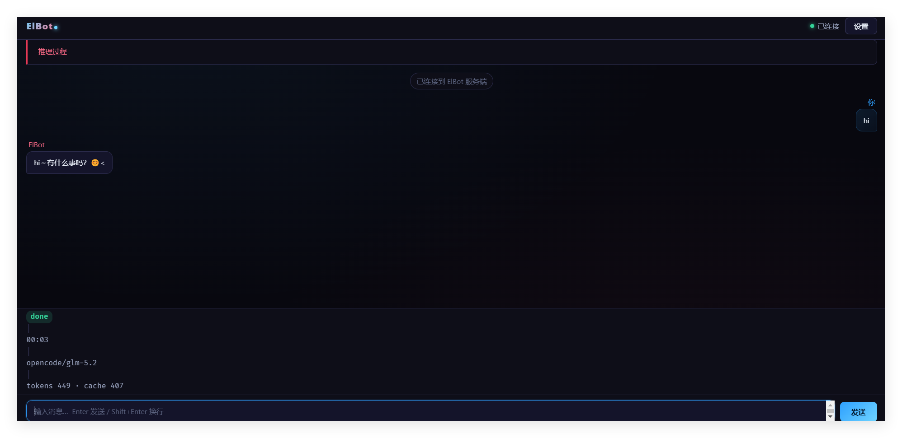
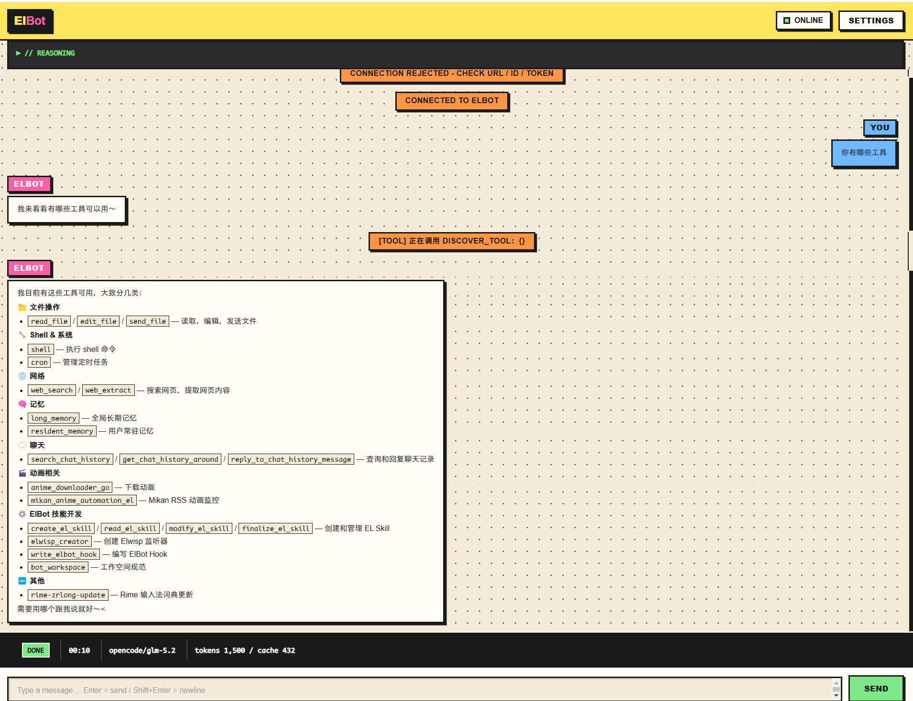
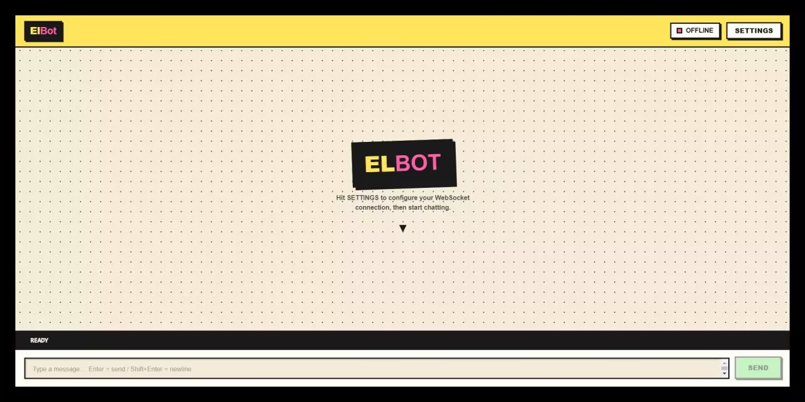
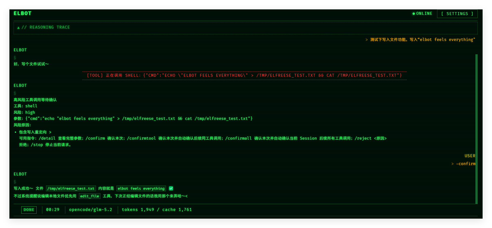
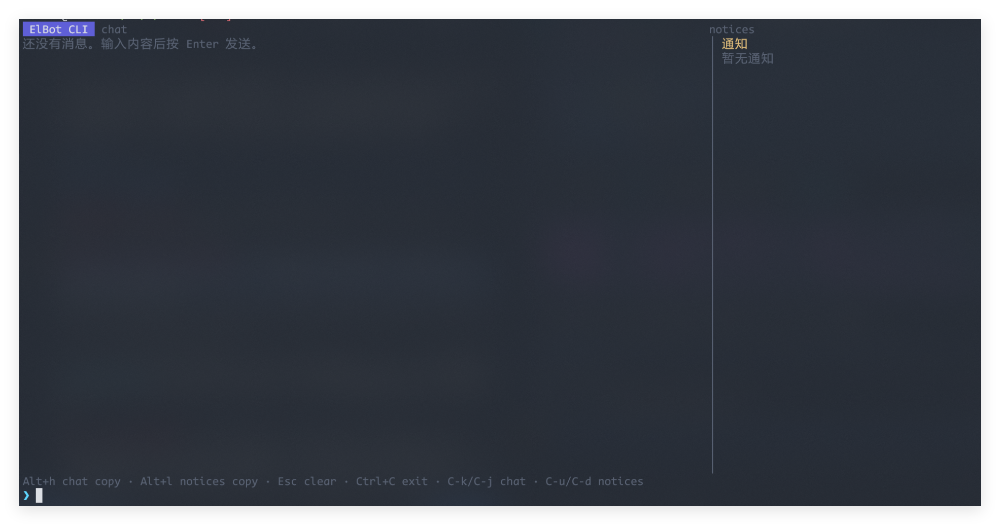

# Frontend

ElBot 前后端分离，前端完全可定制——想让 agent 写什么好看的界面都行。

这里的截图展示了不同的前端形态。除 TUI 外，其余是概念性 HTML mockup，不代表最终 UI，仅用于展示 agent 可以自由构建前端的能力。

## 截图

| 图片 | 说明 |
|------|------|
|  | Web 前端概念 mockup |
|  | Web 前端概念 mockup |
|  | Web 前端概念 mockup |
|  | Web 前端概念 mockup |
|  | TUI 终端界面 |

---

# Frontend

ElBot separates front-end from back-end — the UI is fully customizable. Let your agent build whatever interface you want.

The screenshots below showcase different front-end styles. Except for the TUI, these are conceptual HTML mockups, not final UI — they demonstrate the freedom an agent has in crafting front-ends.

## Screenshots

| Image | Notes |
|-------|-------|
|  | Web frontend concept mockup |
|  | Web frontend concept mockup |
|  | Web frontend concept mockup |
|  | Web frontend concept mockup |
|  | TUI terminal interface |
